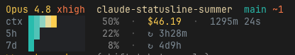

# claude-statusline-summer

> [Claude Code](https://code.claude.com/)를 위한 여름 테마 상태줄 — 테마는 이모지가 아니라 색으로 표현됩니다.

[English](./README.md) | **한국어**



모델, 현재 폴더, git 상태, 컨텍스트 사용량, 세션 비용/시간, 그리고 5h/7d rate
limit을 보여줍니다. 잔잔한 청록 → 타오르는 빨강으로 흐르는 **하나의 선셋
그라데이션 게이지**를 컨텍스트와 5h/7d rate limit에 똑같이 재사용해서, 모든
게이지가 같은 시각 언어를 공유합니다: **찰수록 뜨거워 보인다.**

## 요구사항

- **bash** (macOS 기본 bash 3.2에서 동작)
- **[jq](https://jqlang.github.io/jq/)** — `brew install jq` / `sudo apt install jq`
- **색을 지원하는 터미널.** 트루컬러(24-bit)를 자동 감지해 우선 사용하고,
  지원하지 않는 터미널(예: Apple Terminal.app)에서는 띠 없는 256색 팔레트로 폴백합니다.

## 설치

```bash
git clone https://github.com/jgoneit/claude-statusline.git
cd claude-statusline
./install.sh
```

`install.sh`는 `jq`를 확인하고, 스크립트를 `~/.claude/statusline.sh`로 복사한 뒤
`~/.claude/settings.json`에 등록합니다 — 기존 설정을 먼저 백업하고, 이미 다른
status line이 있으면 교체 전에 물어봅니다.

<details>
<summary>수동 설치</summary>

1. `statusline.sh`와 **`themes/` 폴더**를 나란히 복사 (예: `~/.claude/statusline.sh` + `~/.claude/themes/`) 후 스크립트에 `chmod +x`.
2. `~/.claude/settings.json`에 **절대 경로**로 등록:

   ```json
   {
     "statusLine": {
       "type": "command",
       "command": "/스크립트/절대경로/statusline.sh",
       "refreshInterval": 10
     }
   }
   ```
</details>

## 설정

| 변수 | 값 | 효과 |
|---|---|---|
| `STATUSLINE_THEME` | `summer` (기본) \| `christmas`† | `themes/<name>/colors.sh` 팔레트 선택; 모르는 이름은 summer로 폴백 |
| `STATUSLINE_COLOR` | `truecolor` \| `256` | 색 모드 강제 (자동 감지 무시). 기존 `STATUSLINE_SUMMER_COLOR`도 계속 동작 |
| `STATUSLINE_DEMO_PCT` | `0`–`100` | 스샷용: 실제 데이터 대신 모든 게이지를 이 퍼센트로 채움 |

- † `christmas`는 스캐폴드(빈 팔레트) — `colors.sh`를 채우기 전까지는 무채색으로 렌더링됩니다.
- tmux에서 트루컬러를 쓰려면 `~/.tmux.conf`에 `set -ga terminal-overrides ",*:Tc"` 필요.
- `refreshInterval`(settings.json)은 스크립트를 주기적으로 재실행해서 유휴 상태에서도
  경과 시간이 갱신되게 합니다; 빼면 새 메시지마다만 갱신됩니다.

## 표시 항목

| 항목 | 설명 |
|---|---|
| `Opus 4.8` | 현재 모델 (골드) |
| `xhigh` | 모델 오른쪽의 추론 effort (low→max); 미지원 모델에선 생략 |
| `my-app` | 현재 폴더 (샌드) |
| `main +1 ~2 ↑1 ↓3` | 브랜치(청록) · 스테이지 `+`(골드) · 변경 `~`(코랄) · upstream 대비 ahead `↑` · behind `↓` — 저장소 안에서만 |
| `ctx ████▌░░░░░ 43%` | 컨텍스트 사용량 — 청록→빨강 그라데이션 게이지; 퍼센트도 게이지 색으로 칠해짐 |
| `$0.21` · `⧗ 00h 09m` | 세션 비용 · 경과 시간 |
| `5h … 58% · ⧗ 04h 35m` | 5시간 rate limit 사용량 + 남은 시간 — Pro/Max |
| `7d … 40% · ⧗ Wed 15:47` | 7일 rate limit 사용량 + 리셋 시점 — Pro/Max |

첫 응답 전에는 5h/7d 줄이 흐린 `--` 플레이스홀더로 떠서, 데이터가 도착할 때 레이아웃이 들썩이지 않습니다.

## 커스터마이즈

테마는 `themes/<name>/colors.sh`의 색상 전용 파일이고, 엔진은 `statusline.sh`에 있습니다:

- **테마 팔레트** — `themes/<name>/colors.sh`가 10단계 `SUNSET` 그라데이션과 `C_*` 강조색(`C_MODEL` `C_DIR` `C_GIT` `C_STAGE` `C_MOD` `C_MUTE`)을 트루컬러/256 두 벌로 정의. 새 테마는 `summer/`를 복사해서 시작.
- **게이지 모양** — `statusline.sh`의 `bar()` 함수 (10칸, 반칸 `▌`로 5% 해상도).
- **표시 항목·순서** — `statusline.sh` 하단의 `printf '%s\n' …` 행.

mock JSON으로 바로 미리보기:

```bash
echo '{"model":{"display_name":"Opus 4.8"},"workspace":{"current_dir":"'"$PWD"'"},"context_window":{"used_percentage":43},"cost":{"total_cost_usd":0.21,"total_duration_ms":570000},"session_id":"demo","rate_limits":{"five_hour":{"used_percentage":58},"seven_day":{"used_percentage":40}}}' | ./statusline.sh
```

## 라이선스

MIT © jgoneit
